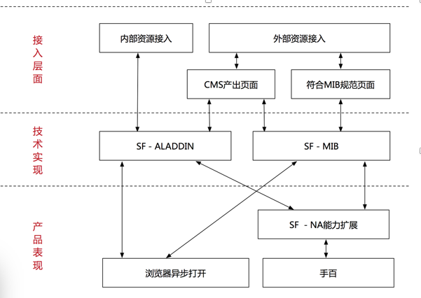

# 了解Superframe

## 背景

suerframe是一套前端解决方案，使用后可以有下面的收益：

* 提升用户点出的交换体验，提供NA化的浏览方式，增加用户浏览媒体时长；
* 增加用户结果页交换步长，构建完整的用户闭环体验，创造变现空间；
* 提升用户点出访问速度；
* 在手百上可以获取NA加强体验
* 增加点击率等用户指标

下面将从数据流拆解、框架图、模块划分几个角度来介绍superframe

## superframe的整体概述



superframe整个解决方案可以从三个方面来描述，下面的sf为superframe的缩写：

* 数据接入层

```
  对于数据的接入，整体分为2种类型：内部资源（百度系的产品），外部资源（第三方站点）；
  内部资源：推荐使用sf-aladdin的形式来接入sf；对于sf-aladdin的方式，数据通过xml或者AE连接第三方服务，然后接入情景页的app；
  外部资源：
  	1. xml形式提交数据
  	2. cms提交自媒体数据
  	3. 站长提交符合mip规范的html页面
  	4. spider抓取
  
```
* 技术实现层

```
在技术上支持sf-aladdin和sf-mib的展现形式：
sf-aladdin: 数据需要打通到情景页的服务，产品体验会更好，兼容性更好，性能体验更好
sf-mib：第三方直接提供mibhtml页面的形式，这种形式定位于浏览型页面，对于交互要求不高；因为技术层面有一些无法逾越的bug，因此如果有非常复杂的交互，建议选用sf-aladdin形式；
```
* 产品表现：

```
	不管采用那种形式，产品表现上，都是沉浸式的浏览体验，在手百上，可以获取更好的，端的体验
	
```


## superframe的框架图
superFrame整天框架图如下：


* Route：route模块主要用于管理结果页Hash，基于当前的hash lib再做一层封装，直接面向Superframe框架提供由hash转化后的结构化数据。
* Controller:Controller模块功能与MVC中的Controller基本一致，主要用于异步单页应用的调度管理，处理业务逻辑。
* View：统一的视图层，用于统一单页的模板渲染、交互，以及框架级别日志整合。


## 关于日志和统计

日志分为2块：

* 用户行为日志：webb
* 点击日志： tc跳转
 
