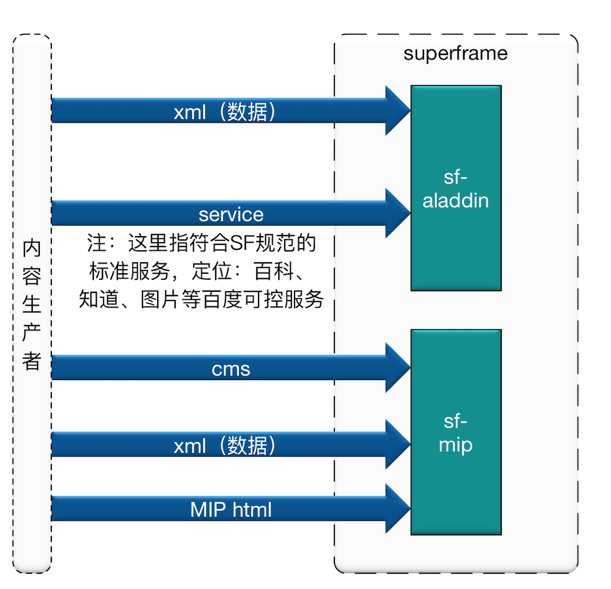

# Superframe概述

## 背景
	
为了切合搜索新生态的落地，提升用户体验；从技术的角度，提出了superframe：提升用户体验的一个前端极速浏览框架。框架目标是：

* 更快的页面加速
* 更多的用户到达
* 更好的浏览体验
* 低成本的接入方式

## Superframe介绍
### 定义
* Superframe：前端极速浏览框架，是一种前端异步单页技术。用户触发点击时，以浮层方式或者NA方式在当前页将内容展现给用户，产品上称为情景页，缩写：SF
* sf-aladdin：内容生产者，通过xml或者直接服务对接的形式（百科知道）接入情景页。
* MIP（mobile instant page）：移动网页加速器，是百度提出的应用于移动网页，提供更好的页面加速和浏览体验的一套开放性的技术标准.
* MIP与SuperFrame：MIB是站点共享SuperFrame体验方式接入百度结果页的一种合作方式；站点通过MIP打通SuperFrame框架，简称：**SF-MIP**

### Superframe产品流变化

###资源方数据接入superframe方式

## MIP介绍

### 整个MIP系统的组成如下所示

* MIP规范：规定站长怎么来进行MIP HTML开发
* MIP的运行环境：提供MIP HTML的运行环境
* MIP的cache系统

### 通过MIP接入百度方式
内容生产者，通过MIP方式接入百度，可以有下面形式:

### 业界类似方案

* Google AMP方案：提升页面加载速度，对于第三方页面加载速度提升20%~80%
* Facebook Instant Article
	* 提升体验，借助客户端能力
	* 增加20%点击,减少70%放弃,增加30%分享 

## Superframe & MIP的收益
* 速度更快
* 体验更好：沉浸式、手百的端能力加强
* mip的身份标识
* 搜索的权重加分


