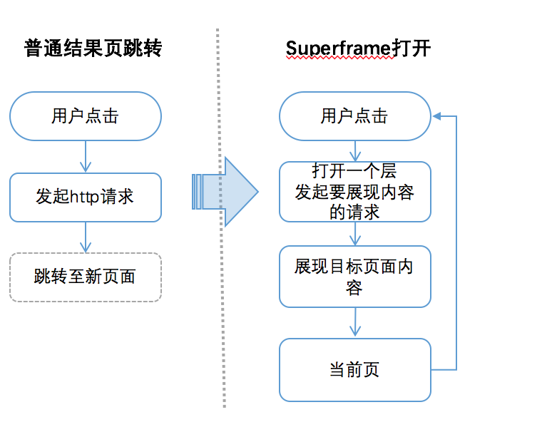
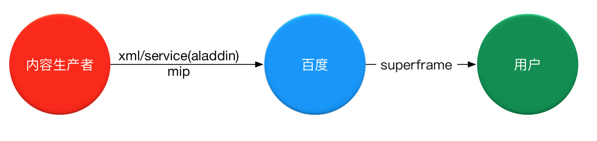
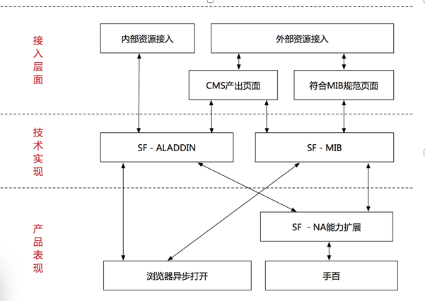
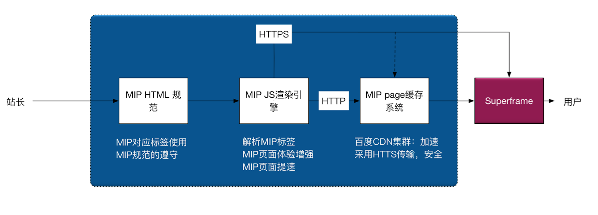
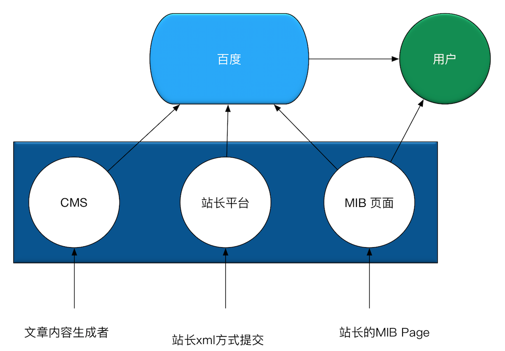

# Superframe概述

## 背景
	
6.8日，百度发布搜索新生态，在搜索新生态中，一个中心：用户体验；而Superframe本身是从技术角度，提升用户体验的一个前端极速浏览框架，可以提供：

* 更快的页面加速
* 更多的用户到达
* 更好的浏览体验
* 低成本的接入方式

## Superframe原理
SuperFrame：前端极速浏览框架，是一种前端异步单页技术。用户触发点击时，以浮层方式或者NA方式在当前页将内容展现给用户。

**流程如下图显示**



**superframe的整个数据流示意图**



## Superframe与MIP关系
### Superframe框架图



* 数据接入层

```
整体分为2种类型：内部资源（百度系的产品），外部资源（第三方站点）；
内部资源：推荐使用sf-aladdin的形式来接入sf；对于sf-aladdin的方式，数据通过xml或者AE连接第三方服务，然后接入情景页的app，也可以直接通过sf-appservice的方式接入；
  外部资源：
      1. xml形式提交数据
      2. cms提交自媒体数据
      3. 站长提交符合mip规范的html页面
      4. spider抓取
      
```
 
* 技术实现：

```
在技术上支持sf-aladdin和sf-mib的展现形式：
sf-aladdin: 数据需要打通到情景页的服务，产品体验会更好，兼容性更好，性能体验更好
sf-mib：第三方直接提供mibhtml页面的形式，这种形式定位于浏览型页面，对于交互要求不高；因为技术层面有一些无法逾越的bug，因此如果有非常复杂的交互，建议选用sf-aladdin形式；
```
### Superframe、MIP和SF-MIP
* MIP（mobile instant page）：移动网页加速器，是百度提出的应用于移动网页，提供更好的页面加速和浏览体验的一套开放性的技术标准
* MIP与SuperFrame：MIB是站点共享SuperFrame体验方式接入百度结果页的一种合作方式；站点通过MIP打通SuperFrame框架，简称：**SF-MIP**

 

## MIP

**整个MIP系统的组成如下所示**


* MIP规范
* MIP的运行环境
* MIP的cache系统

## MIP接入百度方式
通过MIP方式接入百度，可以有下面几个途径:




## 业界的方案

* Google AMP方案：提升页面加载速度，对于第三方页面加载速度提升20%~80%
* Facebook Instant Article
	* 提升体验，借助客户端能力
	* 增加20%点击,减少70%放弃,增加30%分享 

## Superframe & MIP的收益
* 速度更快
* 体验更好：沉浸式、手百的端能力加强
* mip的身份标识
* 搜索的权重加分



