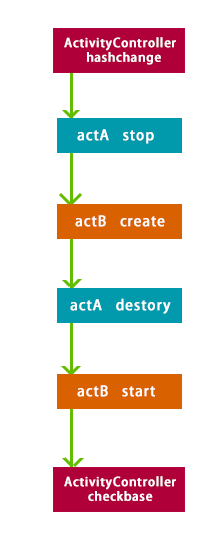
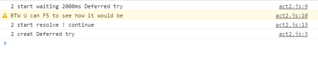

# activity使用API规范

###Activity类

    Activity为情景页基类，情景页的交互、展现、日志等通用接口，统一由Activity进行接管。针对Activity生命周期，对外提供注入功能。
    功能上，Activity提供一个屏幕，用来和用户完成指定交互，当任何Activity应用调起时，会隐藏检索结果页。
    同一个页面内，只存在一个Activity的应用/实例

####基类说明
    基类定义了Activity的生命周期，在各生命周期之内实现Activity的基础交互功能，同时也提供对应的接口注入。各生命周期描述如下：

#####create（创建）

    基类在创建时，会调用View层，实现整体情景页全屏效果的展现。同时，进行Activity的各参数初始化

#####start（开始）

    基类在start周期里，建议对进行页面的数据加载以及渲染等操作，这些操作可以通过注入function到start中完成，提供注入接口。
    注意：start状态会在上一个controller或activity的destroy方法后执行。

#####stop（停止）

    当调起下一个activity时，当前的基类会被替换，此时最先执行基类的stop方法。

#####destroy（销毁）

    销毁方法在上一个基类的create方法之后执行，主要进行整体activity实例析构、dom隐藏/销毁等操作，提供注入接口。

#####change（变更）

    change方法主要用于处理相同的activity实例之间的切换。

####创建一个Activity应用
    
    当前Activity应用仅支持AMD的加载方式，故开发遵从结果页AMD开发规范。

    [定义] 首先在\static\js\global\esl_config.js中添加amd模块映射
```
           'activity/demo/act0': __getAmdUri("/static/js/activity/demo/act0.js")
```
    [强制] 名称必须以activity/起始
    [强制] 存放路径必须位于/static/js/activity/目录下，可根据需求，创建模块目录集中管理，但名称尽量保留路径关系
           例如activity/demo/act0  映射 /static/js/activity/demo/act0.js
           按以上方式命名，该activity实例在开发过程中使用的名称为demo/act0

####Activity应用的生命周期
    
    按时序，Activity组件从初始化到销毁会经历create、start、change、stop、destroy操作改变运行状态
        create  创建组件实例，处理view展现前的初始化工作
        start   页面渲染
        change  根据状态参数改变当前场景
        stop    停止当前场景，一般在此开始对view进行隐藏/屏蔽
        destroy 销毁当前组件

```
需要注意的是，当实例A切换到实例B时，按以下顺序执行实例方法
```


####开发Activity实例需要实现的接口方法
```javascript
    为了保证Activity实例能响应ActivityController的调用，Activity实例需要实现上述接口（但如未定义某个方法，将会被跳过）
        create  function(state,env) //state 为当前场景状态，也是Hash里保存的值，env为环境变量，下同
        start   function(state,env)
        change  function(state,env)
        stop    function(oldState,env) //oldState为当前场景的state
        destroy function(oldState,env)

        env为环境变量对象，提供运行环境参数
        {result:boolean  //为true时，代表当前场景由结果页首屏调用进入}
```

```javascript
    /static/js/activity/demo/act0.js

    define(function() {
        function create(state,env) {console.log('0 create', state,env);}
        function start(state,env) {console.log('0 start', state,env);}
        function change(state) {console.log('0 change', state);}
        function stop(state) {console.log('0 stop', state);}
        function destroy(state) {console.log('0 destroy', state);}
        return {
            create: create,
            start: start,
            change : change,
            stop: stop,
            destroy: destroy
        }
    });

```
各接口中会传递env变量，env变量中提供了routeState参数，routeState有两种状态：
```javascript
//获取方法
env.routeState
//值枚举：
env.routeState == 'virtual' //表示此次操作是用户界面中主动触发（调用B.activity.pushState）
env.routeState == 'natural' //表示此次操作是浏览器自身的行为（包括前进回退以及js直接history操作）
```

如果接口方法内需要实现进程的接管，可以在方法内实现Deferred对象并在函数结束时返回，但该Deferred对象必须实现resolve，否则无法继续进行。
```
    function create(state,env) {
        if(env && env.result){
            console.log('2 create from F5 continue');
        }else{
            console.log('2 create waiting 2000ms', state);
            console.warn('BTW U can F5 to see how it would be');
            var dtd = $.Deferred();
            setTimeout(function() {
                console.log('2 create resolve ! continue');
                dtd.resolve();
            },
            2000);
            return dtd;
        }
    }


```


###Activity Controller
```
    Activity组件管理模块，管理Activity生命周期及HASH。

    任何关于Activity的Hash改变均应该调用Activity Controller的API来实现，后者会操作HASH，改变各个Activity的运行状态。
    当用户刷新页面时，Activity Controller也会根据HASH恢复Activity的运行状态。
```

####Activity Controller API

```javascript
    B.activity                   全局对象

    B.activity.start             单例初始化方法，页面框架载入时引用一次

    B.activity.pushState(option)    push State到Hash并触发模块接口
        option      object
            activity    String      必选，为activity名称，参考activity AMD 定义规范；值为base时，会触发回到根场景
            state       any object  可选,模块需要传递的状态，可以为任意对象。因为会encode置入URL中，所以该state尽量简约
            silent      boolean     不推荐使用，仅限于详细了解了Activity周期流程且需要兼容现有代码时使用。
                                    静默方式pushHash，不触发模块接口，但会检测自然检索结果
    B.activity.back()
```
####Activity Controller 需求API（规划中，待添加）

```javascript
    B.activity.replaceState(option)    替换当前场景state，触发hashchange，但不形成浏览器历史
        option      object
            state       任意对象    可选,同pushState参数
            silent      boolean     


```
