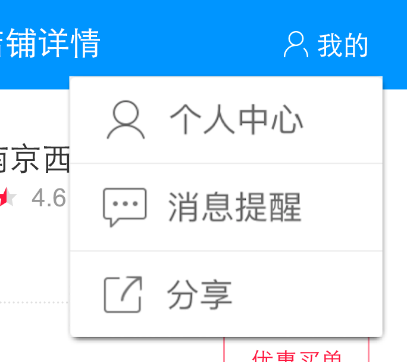
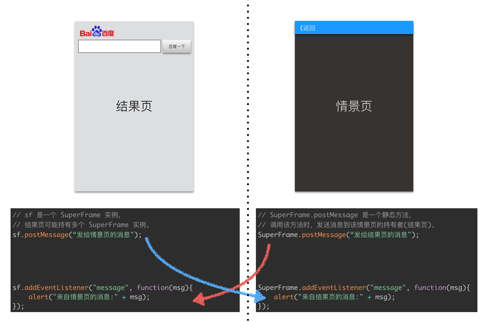

# SuperFrame一期（非动态化）需求

## 产品设计

### 头部导航


头部导航从左往右，分别包含 _返回按钮_、_关闭按钮_、_标题栏_ 和 _右侧按钮_。当点击 _右侧按钮_ 时，可配置一个定制化的 _菜单_。

#### 返回按钮&关闭按钮
_返回按钮_ 和 _关闭按钮_ 文本可配置，但按钮逻辑全部由 Native 接管，_关闭按钮_ 逻辑类似微信浏览框架，具体如下:

1. _关闭按钮_ 默认隐藏。
2. 点击 _返回按钮_ 时优先`goBack`当前页面，如果当前页面没有历史记录，则将当前 SuperFrame 退出。
3. 当连续点击 `N(N=3)` 次 _返回按钮_ 时，如果还有未关闭的 SuperFrame ，则**所有**未关闭 SuperFrame 需要显示 _关闭按钮_。
4. 点击 _关闭按钮_ 时，需要将所有的 SuperFrame 关闭，显示结果页。

#### 标题栏
_标题栏_ 由 Native 接管，初次打开时可以设置一个默认标题，当 SuperFrame 页面加载完成后，使用页面标题作为标题。

#### 右侧按钮
右侧最多可配置一个按钮，该按钮可绑定一个定制化的 _目录_，按钮点击时派发事件到结果页。

### 弹出菜单


_弹出菜单_ 使用固定位置方式，Native 控制菜单的显示和隐藏，当点击菜单项时，需要发送对应的事件到结果页。

### 转场效果


1. 转场效果需要可配置，目前需要支持从右往左和从下往上（退场效果方向相反）。
2. 最多支持 `N(N=5)` 级历史，如果超出则需要删除最下层的 SuperFrame，并派发 `destroy` 事件到结果页。

### Iconfont
每个按钮可指定一个字体文件地址，Native 使用该字体文件渲染该文本，具体的逻辑如下：

1. 按钮有默认字体。
2. 当设置某个字体时逻辑如下：
    * 如果字体需要从网络加载，则将当前文本隐藏，待网络字体加载完成并成功设置后，再显示文本。
    * 如果字体无需下载（有本地缓存），则直接设者字体并显示。


## 技术API

### SuperFrame对象
SuperFrame 对象封装了一个使用 WebView 加载的 SuperFrame 页面，头部分为左中右三部分，有一定的定制性。

#### 方法

##### `void setBackButton(Button button)`
设置返回按钮

##### `void setCloseButton(Button button)`
设置关闭按钮

##### `void setDefaultTitle(Button button)`
设置默认标题

##### `void setRightButton(Button button[, Menu menu])`
设置右侧按钮，并绑定对应目录(可选)

##### `void setTitleBarBackgroundColor(int color)`
设置标题栏颜色

##### `void loadUrl(Sring url)`
加载URL

##### `void postMessage(Object message)`
发送消息给该 SuperFrame (结果页->情景页)

##### `void show(String animationType, int duration)`
显示该SuperFrame，**SuperFrame 显示后不能再改变设置**。

#### 事件

##### `load`
页面加载完成时派发

##### `show`
页面显示的时候派发

##### `hide`
页面隐藏的时候派发

##### `destroy`
页面被销毁的时候派发

##### `message`
收到消息的时候派发 (情景页->结果页)

### Button对象
作为一个按钮对象，目前只包含文本，使用 iconfont 来实现图标。

#### 方法

##### `void setText(String text)`
设置文本

##### `void setColor(int color)`
设置文本颜色

##### `void setBackgroundColor(int color)`
设置背景颜色

##### `void setActiveColor(int color)`
设置点按时的文本颜色

##### `void setActiveBackgroundColor(int color)`
设置点按时的背景颜色

##### `void setFontSize(int size)`
设置文本大小

##### `void setFontUrl(String url)`
设置文本所用字体地址

##### `void setFontStyle(String style)`
设置文本样式(斜体:italic)

##### `void setFontWeight(String weight)`
设置文本粗体(粗体:bold)

#### 事件

##### `touchstart`
点击开始时派发

##### `touchend`
点击结束时派发


### Menu对象
Menu用于做弹出菜单，内容可配置，一期可以固定位置，当点击非目录区域时，需要自动消失（因为一期没法监听到非按钮的点击）。

##### `void addButton(Button button, int index)`
    往目录中添加一个按钮

##### `void removeButtonAt(int index)`
    从目录中删除一个按钮

####事件
##### `show`
    显示时派发

##### `hide`
    隐藏时派发


## 编程示例
### 完整例子

```javascript
var ICONFRONT_URL = "http://xxx.ttf";
var sf = new SuperFrame();

// 创建返回按钮
var backBtn = new Button();
backBtn.setFontUrl(ICONFRONT_URL);
backBtn.setText(String.fromCharCode(7349) + "返回");
backBtn.setFontSize(16);
backBtn.setColor(0xffffffff | 0);
backBtn.setActiveBackgroundColor(0xffcccccc | 0);
sf.setBackButton(backBtn);

// 创建标题
var title = new Button();
title.setText("金鼎轩");
title.setFontSize(18);
title.setColor(0xffffffff | 0);
sf.setDefaultTitle(title);

// 创建目录
var menu = new Menu();
var shareBtn = new Button();
shareBtn.setText("分享");
shareBtn.addEventListener("touchend", function(){
    // 调起分享
});
menu.addButton(shareBtn, 0);

// 创建目录按钮
var menuBtn = new Button();
menuBtn.setFontUrl(ICONFRONT_URL);
menuBtn.setText(String.fromCharCode(8249));
menuBtn.setFontSize(16);
menuBtn.setColor(0xffffffff | 0);
menuBtn.setActiveBackgroundColor(0xffcccccc | 0);
sf.setRightButton(menuBtn, menu);

// 显示当前的SuperFrame
sf.show("LEFT_TO_RIGHT", 500);
```

### 事件通讯


#### 结果页向某个情景页发送消息

```js
// 这段代码运行在结果页
// sf 是一个 SuperFrame 实例，
// 结果页可能持有多个 SuperFrame 实例。
sf.postMessage("发给情景页的消息");
sf.addEventListener("message", function(msg){
    alert("来自情景页的消息:" + msg);
});
```

#### 情景页向该情景页的持有者（结果页）发送消息

```js
// 这段代码运行在某个情景页
// 这里的 SuperFrame.postMessage 是一个静态方法，
// 调用该方法时，发送消息到该情景页的持有者(结果页)。
SuperFrame.postMessage("发给结果页的消息");
SuperFrame.addEventListener("message", function(msg){
    alert("来自结果页的消息:" + msg);
});
```
