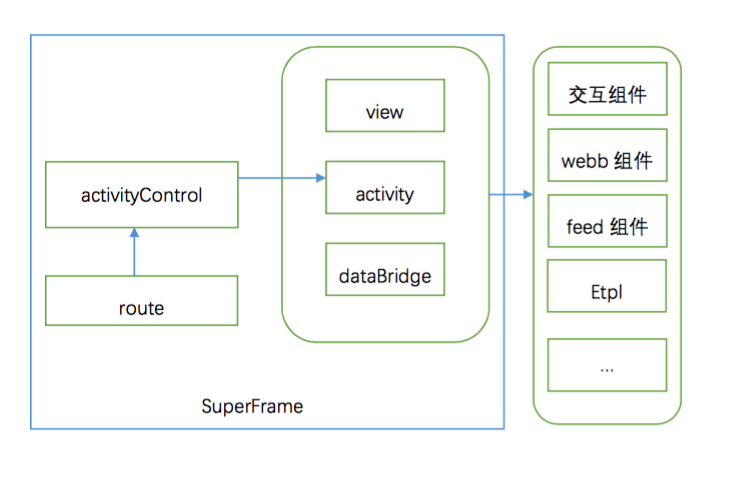

# superFrame方案说明
> by shenzhou

## 背景

为了满足无线搜索结果页的超级frame层的富交互，而设计的一套解决方案，整个方案包括下面几个部分

* 代码框架抽象
* 一致性的交互体验
* 统一的日志解决方案

下面会从这几个方面，分别阐述整个方案

## superFrame前端框架
superFrame整天框架图如下：

* Route：route模块主要用于管理结果页Hash，基于当前的hash lib再做一层封装，直接面向Superframe框架提供由hash转化后的结构化数据。
* Controller:Controller模块功能与MVC中的Controller基本一致，主要用于异步单页应用的调度管理，处理业务逻辑。
* View：统一的视图层，用于统一单页的模板渲染、交互，以及框架级别日志整合。
* Activity：Activity是情景页的抽象，具体功能：实现一个全屏单页，用来和用户完成指定交互，当任何Activity情景调起时，会隐藏自然检索结果。 
* Databridge：提供Superframe统一的数据存储机制，解决多Controller或多Activity交互时的数据管理功能。

## 一致性交互组件

无线结果页的交互效果通过组件的形式提供，但是具体到superframe来，需要统一的视图(view)层来管理生周期
* 统一的view层抽象
* 统一的交互效果组件

## 关于日志和统计

日志分为2块：

* 用户行为日志：webb
* 点击日志： tc跳转
 
